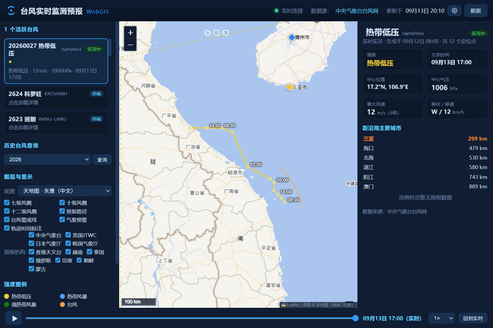
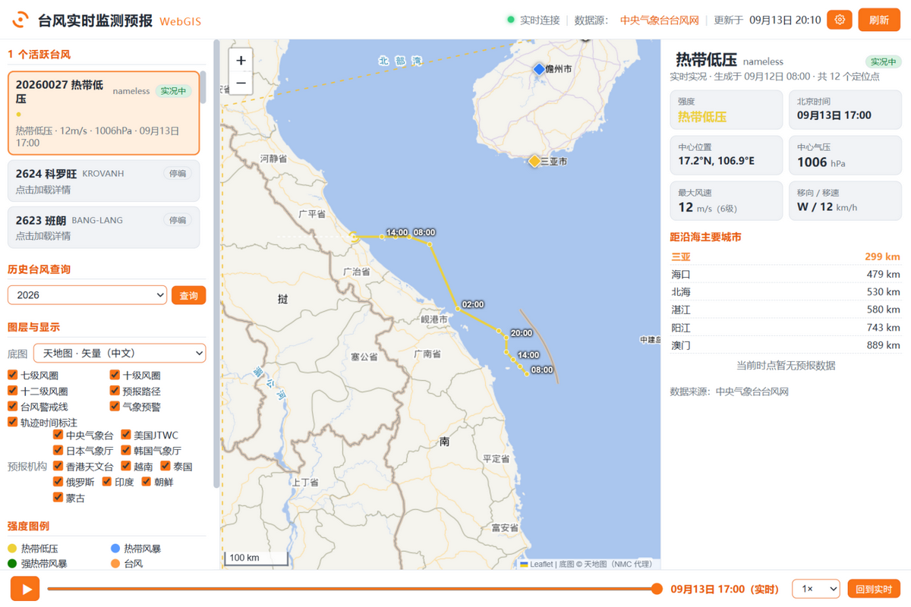
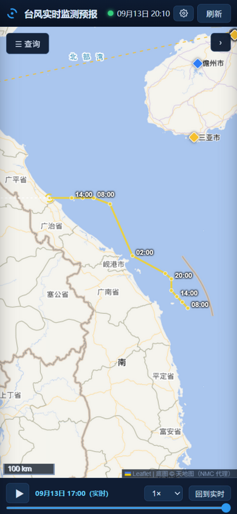

# 台风实时监测预报 WebGIS

**基于中央气象台台风网（typhoon.nmc.cn）的台风实时监测与预报可视化系统。**
前后端全栈实现：Node.js **零 npm 依赖**后端 + Leaflet 前端，SSE 实时推送，中英双语，深/浅双主题，移动端自适应，中国/海外双数据线路，支持 Docker 一键部署。

**作者：ZHAO XUEJIN** · 仅供学术交流，非商用。

[](https://nodejs.org) [](https://leafletjs.com) [](#测试) [](https://www.docker.com) [](LICENSE)

| 深色主题（桌面） | 浅色主题（桌面） | 移动端 |
| --- | --- | --- |
|  |  |  |

## 功能特性

| 模块 | 说明 |
| --- | --- |
| 🌀 实时监测 | 西太平洋/南海活跃台风，SSE 实时推送，新定位点自动上图并弹窗提示 |
| 📈 路径回放 | 全生命周期轨迹回放（0.5×~4× 变速、空格键播放/暂停），可回看**当时发布的历史预报** |
| 🎯 预报路径 | 中央气象台（BABJ）等 11 家机构预报路径对比，24/48/72h… 预报点悬停详情 |
| 🌪 风圈渲染 | 七级/十级/十二级风圈**四象限半径**（东北/东南/西南/西北），方位基点平滑过渡 |
| ⚠️ 气象预警 | 全国城市预警信号（蓝/黄/橙/红）实时上图，点击查看详情 |
| 🗺 底图切换 | 天地图矢量/影像/地形（经 NMC 代理，无需申请 key）、Esri、OSM |
| 🗃 历史台风 | 2015 年至今逐年台风查询；无活跃台风时地图自动给出历史查询引导 |
| 🌐 中英双语 | 全部界面文案（含地图悬浮提示、详情面板、图例）中文/English 一键切换 |
| 🎨 双主题 | 深色控制台风 / 浅色（白为主、灰为辅、橙色按钮），一键切换 |
| 📱 布局切换 | 自动（按屏幕宽度）/ 桌面（平铺面板）/ 移动（抽屉式），可在设置中自由指定 |
| 🌏 双数据线路 | 自动按时区选择：中国线路默认天地图底图，海外线路默认 Esri 底图，全球用户均可用 |
| ⚙️ 设置中心 | 语言 / 布局 / 主题 / 数据线路集中管理，全部偏好本地记忆 |

## 数据源说明（真实 · 免费）

| 数据 | 来源 | 说明 |
| --- | --- | --- |
| 台风列表/路径/预报/预警 | [中央气象台台风网](http://typhoon.nmc.cn) `weatherservice` 公开接口 | 免费、无需鉴权，全球可达；这是全球唯一免费提供结构化逐时定位+多机构预报的权威源 |
| 天地图底图瓦片 | `image.nmc.cn`（中央气象台代理） | 免费公开，国内加载快；经本系统后端代理并磁盘缓存 |
| Esri / OSM 底图 | ArcGIS Online / OpenStreetMap | 免费，海外加载快；作为海外线路默认底图 |

> 数据线路只影响底图选择；台风数据始终来自中央气象台。设置页内已注明数据来源与免责声明。

## 技术亮点

- **零 npm 依赖的全栈实现** —— 后端仅用 Node.js 内置模块（`http`/`fetch`/`fs`）完成 REST API、SSE 广播、瓦片代理与磁盘缓存；`npm start` 即跑，无需 `npm install`。
- **SSE + 数据指纹增量推送** —— 定时轮询上游，比对数据指纹（id/点数/最后定位时间），仅在数据变化时向所有客户端广播全量快照；断线自动重连 + 前端兜底轮询双保险。
- **天地图瓦片代理与 LRU 磁盘缓存** —— 底图经后端代理，无需天地图 key；磁盘缓存上限可配，超限自动按 LRU 清理（`TILE_CACHE_MAX_MB`）。
- **四象限风圈几何重建** —— 从官方前端代码逆向出风圈数据结构（`[等级, 东北, 东南, 西南, 西北]`），在方位基点 ±5° 做相邻象限线性混合，渲染出平滑闭合的风圈曲线。
- **JSONP 上游数据解包** —— 兼容 `cb(payload)` / `cb((payload))` 两种包装的解包与容错解析，对字段缺失、停编台风等边界情况做归一化处理。
- **自研轻量 i18n** —— `data-i18n` 属性 + 字典插值，静态/动态文案全覆盖，含地图悬浮提示与时间格式的本地化（`MM月DD日` vs `Aug 30`）。
- **测试与 CI** —— 使用 Node.js 内置 `node:test`（依然零依赖）覆盖后端解析、i18n 与前端领域几何函数共 26 个用例，GitHub Actions 每次 push 自动回归。

## 快速开始

### 方式一：本地运行（需 Node.js ≥ 18）

```bash
npm start          # 或: node server/index.js
# 浏览器打开 http://localhost:8080
```

零 npm 依赖，无需 `npm install`。

### 方式二：Docker

```bash
docker compose up -d --build
# 浏览器打开 http://localhost:8080
```

### 运行测试

```bash
npm test           # node --test，26 个用例，无需安装任何依赖
```

## 设置页

点击顶栏 ⚙ 打开设置（偏好自动记忆）：

- **界面语言**：中文 / English
- **布局模式**：自动 / 桌面 / 移动（PC 与手机布局自由切换）
- **主题外观**：深色 / 浅色（白底、灰辅、橙色按钮）
- **数据线路**：自动（按时区）/ 中国 / 海外

## 配置项（环境变量）

| 变量 | 默认 | 说明 |
| --- | --- | --- |
| `PORT` | `8080` | 服务端口 |
| `POLL_INTERVAL_MS` | `300000` | 上游数据轮询间隔（失败时 30s 自动快速重试） |
| `TILE_CACHE_MAX_MB` | `300` | 天地图瓦片磁盘缓存上限（LRU 清理） |
| `NMC_UPSTREAM` | `http://typhoon.nmc.cn` | 中央气象台数据源地址 |

## 架构

```
┌───────────────────────────── 浏览器 ─────────────────────────────┐
│  Leaflet 地图（轨迹/风圈/预报/警戒线/预警）                        │
│  侧栏台风列表 · 详情面板 · 时间轴回放 · 图层控制 · 设置中心         │
│  中英双语 · 深浅双主题 · 桌面/移动双布局                           │
└──────────────┬──────────────────────────┬────────────────────────┘
       EventSource(SSE) / REST        瓦片请求 /tiles/tianditu/*
               ▼                          ▼
┌──────────────────────── Node.js 后端 (server/) ───────────────────┐
│  index.js   HTTP 服务 + SSE 广播 + 静态资源 + 瓦片代理(磁盘缓存)   │
│  nmc.js     中央气象台接口客户端：JSONP 解包/编码/解析/内存缓存    │
│  定时轮询(5min) → 数据指纹比对 → 变化时 SSE 推送全量快照           │
└──────────────┬────────────────────────────────────────────────────┘
               ▼
   typhoon.nmc.cn/weatherservice/*   （台风列表/详情/预警）
   image.nmc.cn/tiles/tianditu/*     （天地图底图瓦片代理）
```

### 后端 REST API

| 接口 | 说明 |
| --- | --- |
| `GET /api/typhoons` | 活跃台风完整数据（含轨迹/风圈/预报）+ 近期停编简表 |
| `GET /api/typhoons?year=2025` | 某年台风简表 |
| `GET /api/typhoons/:id` | 单个台风完整数据（缓存 2min/停编 6h） |
| `GET /api/warnings` | 全国气象预警（带坐标/等级/正文） |
| `GET /api/meta` | 数据源、预报机构、强度色带等元信息 |
| `POST /api/refresh` | 清缓存并立即重新拉取上游 |
| `GET /api/stream` | SSE 实时推送（`typhoons` / `warnings` 事件） |
| `GET /api/health` | 健康检查 |
| `GET /tiles/tianditu/{layer}/{z}/{x}/{y}.png` | 天地图瓦片代理（vec/cva/img/cia/ter/ibo） |

### 测试

测试位于 `test/`，基于 Node.js 内置 test runner（无任何第三方依赖）：

- `test/nmc.test.js` —— JSONP 解包、UTC 时间解析、定位点/风圈/预报解析、移向归一化、乱序定位点排序、数据指纹稳定性；
- `test/typhoon.test.mjs` —— 前端领域函数：蒲福风力换算、大圆距离、北京时间格式化、十六方位角、强度比较、**四象限风圈几何**（闭合性、半径包络校验）；
- `test/i18n.test.mjs` —— 双语字典回退、插值、名称/时间/风力等级的语言切换。

### 上游数据结构（解析自官方站点前端代码）

- 列表 `typhoon/jsons/list_default`：`[id, 英文名, 中文名, 台风号, …, 状态(start/stop)]`
- 详情 `typhoon/jsons/view_{id}`：点位 `[时间(UTC), 强度码, 经度, 纬度, 气压, 风速, 移向, 移速, 风圈, 预报, …]`
  - 风圈：`[等级(30/50/64KTS), 东北, 东南, 西南, 西北]`（km）
  - 预报：`{ 机构代码: [[时效h, 发布时间, 经度, 纬度, 气压, 风速, 机构, 强度码], …] }`

## 常见问题（Troubleshooting）

**Docker 容器内拉取上游数据返回 HTTP 500 / 连接被拒**

错误形如 `connecting to 127.0.0.1:7890: connectex: ... refused`，说明 Docker Desktop 把容器
流量转发到了 Windows 系统代理（如 Clash），而该代理当前未运行。任选其一即可：

1. 启动本机代理程序（Clash/V2Ray 等）；
2. Docker Desktop → Settings → Resources → Proxies → 关闭「Use system proxy」或清空手动代理；
3. 改用本地直接运行（`npm start`），该方式不走 Docker 代理链。

**底图瓦片不显示**

中国线路底图经后端代理 `image.nmc.cn`（天地图）获取；若该域名在你的网络不可达，
可在「设置 → 数据线路」切换为海外线路（默认 Esri 底图），或在「图层与显示 → 底图」中手动选择。

**上游接口偶发 `fetch failed`**

中央气象台 CDN 偶有抖动，后端已内置重试与失败后 30s 快速重拉，页面数据不受影响。

## 声明

本系统仅供学术交流使用，非商用。数据与底图均来自中央气象台（nmc.cn）等公开接口，
正式防台决策请以中央气象台官方发布为准。

## 作者

**ZHAO XUEJIN**

## 目录结构

```
typhoon-webgis/
├── server/
│   ├── index.js        # HTTP 服务、SSE、瓦片代理、定时轮询
│   └── nmc.js          # 上游客户端：拉取/解包/解析/缓存/指纹
├── web/
│   ├── index.html      # 页面骨架（data-i18n 双语标记）
│   ├── css/style.css   # 深/浅双主题变量 + 桌面/移动双布局
│   ├── js/app.js       # 状态管理、SSE、面板与回放交互、设置中心
│   ├── js/map.js       # 地图渲染（轨迹/风圈/预报/预警）
│   ├── js/typhoon.js   # 领域工具（强度/风圈几何/格式化/城市/警戒线）
│   ├── js/i18n.js      # 中英双语文案字典
│   └── vendor/leaflet/ # Leaflet 1.9.4 本地化
├── test/               # node:test 单元测试（零依赖）
├── docs/               # 截图
├── Dockerfile / docker-compose.yml
└── data/cache/tiles/   # 瓦片磁盘缓存（自动清理，已 gitignore）
```
